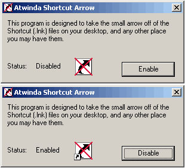



## Arrow on ink file remover

### Description

Have you ever thought about those litte arrows that are in the lower left hand corner of icons on the desktop? Have you noticed it takes longer to load when windows starts to load them? Well, just get rid of 'em! yup this code allows you to remove the arrows! and just incase, bring them back (but why would you want to so that!?) tested to work on win 98/98se/me/2k. almost all commented, and easy to read.
 
### More Info
 

             |
---                |---
**Submitted On**   |2000-12-08 23:08:54
**By**             |[atwinda](https://github.com/Planet-Source-Code/PSCIndex/blob/master/ByAuthor/atwinda.md)
**Level**          |Advanced
**User Rating**    |4.5 (18 globes from 4 users)
**Compatibility**  |VB 5\.0, VB 6\.0
**Category**       |[Registry](https://github.com/Planet-Source-Code/PSCIndex/blob/master/ByCategory/registry__1-36.md)
**World**          |[Visual Basic](https://github.com/Planet-Source-Code/PSCIndex/blob/master/ByWorld/visual-basic.md)
**Archive File**   |[CODE\_UPLOAD125001292000\.zip](https://github.com/Planet-Source-Code/atwinda-arrow-on-ink-file-remover__1-13451/archive/master.zip)

